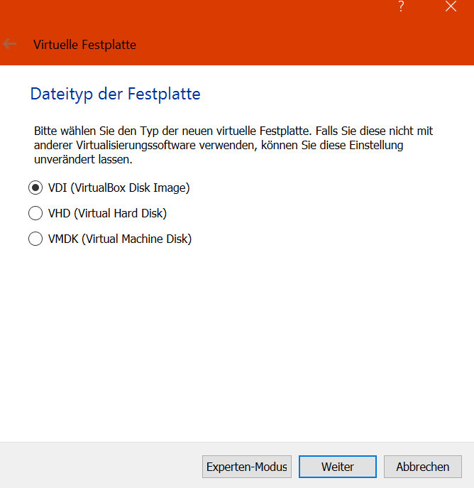

# VirtualBox unter Windows

Um ein neues Betriebssystem auszuprobieren oder bei den ersten Versuchen mit einer neu zu lernenden für eine Programmiersprache und Einrichtung der entsprechenden Entwicklungsumgebung eignet sich die Verwendung einer Virtuellen Maschine (VM) mit Oracle VirtualBox besonders gut. 

Ein Installer steht auf der Oracle- Seite für zahlreiche Betriebssysteme zum Download zur Verfügung.

[Oracle VM VirtualBox - Downloads](https://www.oracle.com/de/virtualization/technologies/vm/downloads/virtualbox-downloads.html)

Eine ausführliche Dokumentation:

[Oracle VM VirtualBox - Oracle VM VirtualBox Documentation](https://docs.oracle.com/en/virtualization/virtualbox/index.html)

Die Installation ist selbsterklärend. Wer mag, kann eine separate Partition für die VMs einrichten. 

Das erhöht die Übersichtlichkeit, ansonsten wird alles in Laufwerk C gespeichert.

## Eine VM einrichten

Nach der Installation VirtualBox öffnen und über die Schaltfläche Neu oder das Menü Maschine - Neu eine leere VM einrichten.

Es öffnet sich dann ein Fenster, in dem  man einen Namen für die neue VM vergeben und den Speicherort auswählen muss. Das Programm erkennt bereits am vergebenen Namen, um welche Art von Betriebssystem es sich handelt, Typ und Version werden automatisch gewählt, lassen sich aber auch ändern.

Gibt man statt im Beispiel oben Windows an, wird als Typ Windows 7 angeboten, über das Pull-Down Menü aber auch zahlreiche andere Versionen.

Hinweis: Hier wird noch kein Betriebssystem installiert, es handelt sich immer noch um eine leere VM

Über die Schaltfläche weiter gelangt man zur Auswahl der Größe des Arbeitsspeichers für die neue VM.

Die Größe der Festplatte lässt sich vor der eigentlichen Installation noch erhöhen, die angebotenen 10  GB sind in der Regel zu knapp.

Über Erzeugen gelangt man zur Auswahl des Datentyps für die Festplatte, diesen bei VDI belassen.

Im nächsten Fenster dynamisch alloziert beibehalten.

Im nächsten Schritt können Ordnername und Maximalgröße der  VM- Festplatte verändert werden. Bis zu dieser Maximalgröße dürfen sich später die Daten der VM ausbreiten. Die VM nimmt immer nur den Speicherplatz ein, der ihrer aktuellen Datenmenge entspricht, das kann also auch deutlich unter der Maximalgröße liegen. Um spätere Probleme zu vermeiden, sollte man die Maximalgröße lieber großzügig bemessen.

Mit Erzeugen wird die VM fertiggestellt und eine Übersicht angezeigt. Die VM ist aktuell noch ausgeschaltet. Mit Starten gelangt man zur Installation des Betriebssystems.

Im Windows-Explorer, die gewünschte Iso-Datei auswählen und mit Öffnen bestätigen. Anschließend erscheint die Datei im Auswahlfenster.

Mit Auswählen bestätigen, dann gelangt man wieder in das anfangs erschienene Fenster und kann dort die Installation mit dem ausgewählten ISO starten.

Der Boot-Manager von Ubuntu erscheint, mit Enter wird gestartet.

Man kann nun Ubuntu als Live-Version testen oder in die neue VM installieren.

Ubuntu installieren führt zur regulären Installationsroutine des Betriebssystems. 

Hinweis: nach dem Abschluss der Installation kann man die Aufforderung, das Installationsmedium zu entfernen (... press Enter) einfach mit der Eingabetaste bestätigen, ohne ein Medium entfernen zu müssen.

## Gasterweiterungen

Damit die VM nicht nur in einem kleinen Fenster angezeigt wird und man das Gastbetriebssystem nutzen kann, wie einen "ganz normalen Rechner", müssen die Gasterweiterungen eingehängt werden.

Auch ist erst dann die Verbindung zum Host- Betriebssystem, beispielsweise mit einer gemeinsamen Zwischenablage oder gemeinsamen Ordnern möglich.

