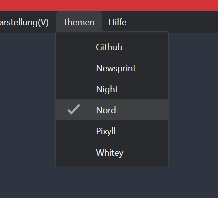

Eine sehr komfortable und unkomplizierte Möglichkeit, unter Windows Texte zu verfassen ermöglicht der Markdown - Editor **Typora**. Auch ist der Editor sehr gut zu bedienen für Menschen mit Augenproblemen, die Oberfläche ist fast vollständig zugänglich für den Screenreader JAWS. 

Zwar lässt das unter Windows schon fast zum Standard gehörende Microsoft- Word bezüglich des Funktionsumfangs kaum Wünsche offen und ist auch weitestgehend mit Screenreader zu bedienen, aber oftmals benötigt man diesen Funktionsumfang gar nicht.

Wer zum Beispiel Texte für eine Website verfasst, für den ist der Markdowneditor in der Regel das bessere Werkzeug.

Das Startfenster von Typora, hier mit dem Thema **Nord**. 

## Installation

Typora steht für die Betriebssysteme Windows, MacOS und Linux zur Verfügung. Für Windows kann man einen Installer von der Herstellerseite herunterladen.

Nach der Installation lässt sich das Aussehen von Typora sehr einfach durch die Auswahl eines Themes anpassen. Zusätzliche Themes können installiert werden. Auf der Website von Typora findet man diese direkt unter dem Menüpunkt **Themes**. Von dort aus wird man zum Download von der jeweiligen Themen- Website weitergeleitet. 

Über `Datei > Einstellungen` findet man umfangreiche Anpassungsmöglichkeiten. 

Hinweis: Leider kann man die Menüpunkte im Seitenbereich mit dem Screenreader nicht ansteuern. Auch das angebotene Suchfeld funktioniert nicht.

 Hier werden auch zusätzliche Themen eingerichtet:

Die Schaltfläche `Themen erkunden` öffnet unmittelbar im Browser die Website mit den verfügbaren zusätzlichen Themen. Nach Download und Entpacken kopiert man den Ordner des Themas und die CSS- Datei des neuen Themas in den Themenordner des Programms. Diesen findet man leicht über die Schaltfläche `Themenordner öffnen` .

Anschließend ist das neue Thema über den gleichlautenden Menüpunkt auswählbar.

## Eine neue Textdatei erstellen

Eine neue Datei erstellt man entweder über den Menüpunkt `Datei > Neu` oder über das Kontextmenü der Seitenleiste. Hier kann man zunächst den gewünschten Ordner öffnen. Die Seitenleiste selbst blendet man mit der Tastenkombination `Umschalt + Strg + L` oder über den Menüpunkt **Darstellung** einein. 

Fährt man mit der Maus über den noch leeren Seitenbereich, wird die Option **Ordner öffnen** eingeblendet, wo die zuvor bereits verwendeten Ordner angeboten werden.

Über das Kontextmenü kann man nun ebenfalls eine neue Datei erstellen und gleich einen Dateinamen vergeben.

Eine weitere Möglichkeit ist das Anklicken des `+` - Symbols in der unteren linken Ecke.

Leider ist der Bereich der Seitenleiste nicht mit Screenreader erreichbar. Die Funktionen zum Erstellen einer Datei sind aber über das Datei- Menü (mit den Tasten `alt + F` ) und anschließender Navigation mit den Pfeiltasten oder mit Tastenkombination `Strg + N` bzw. `Strg + Umschalt + N` zugänglich . 

## Text schreiben und formatieren

Hat man eine Datei erstellt, kann man unmittelbar mit dem Schreiben beginnen. 

Der geschriebene Text wird vom Screenreader direkt beim Schreiben, je nach individueller Einstellung des Screenreaders vorgelesen. 

Alle Formatierungsoptionen lassen sich  

- über Formatierungszeichen der Markdown- Syntax
- über Tastenkombinationen 
- über das Kontextmenü oder
- über die Menüpunkte Format und Absaz 

aufrufen. 

Sehr schnell ist die Formatierung direkt über die Markdown- Syntax, weil man dazu den Schreibfluss nicht verlassen muss. Die grundlegende Syntax ist schnell erlernt,  das Hilfemenü stellt  zudem eine Markdown- Referenz zur Verfügung.

Die Tastenkombinationen, die auch immer in einem Tooltip zur entsprechenden Funktion angezeigt werden, funktionieren auf einer deutschen Tastatur noch nicht immer.

Wer sich mit der Markdownsyntax nicht auskennt, gelangt über das Markieren des zu formatierenden Textbereiches und das **Kontextmenü** schnell und einfach zu allen gewünschten Formatierungen. 

Das Kontextmenü ist aber für den **Screenreader** schlecht zugänglich und auch nur dann, wenn vorher Text markiert wurde.  Nur die Hauptmenüpunkte kann man mit den Pfeiltasten durchlaufen und werden vorgelesen, die Schaltflächen nicht. Das Sub-Menü ist mit den Tasten nicht zu erreichen. 

Statt des Kontextmenüs kann man mit Screenreader aber sehr gut das Hauptmenü nutzen. Die Absatzformatierungen ruft man direkt mit `alt + P` und anschließender Navigation über die Pfeiltasten auf.  Alle Menüpunkte einschließlich der zugehörigen Tastenkombinationen werden vorgelesen. Den Menüpunkt Format, für das Textformat, kann man nicht direkt per Tastenkombination wählen, er befindet sich aber rechts neben dem Menüpunkt Absatz, so dass man von diesem aus nur einmal mit der Pfeiltaste nach rechts navigieren muss. Mit der Zeit prägen sich aber auch schnell die Tastenkombinationen für die direkte Formatierung ein, zumal diese in anderen Programmen oftmals gleich sind.

### Text vergrößern und verkleinern

Von Webseiten und vielen Programmen wird die sehr nützliche  Funktion zum Zoomen des Textes angeboten. Meist wird die Tastenkombination `Strg + +` bzw. `Strg + -` hierfür vorgehalten.  

Bei Typora ändert man (auf einer deutschen Tastatur) mit `Strg + +` aber die Absatzformatierung hin zu verschiedenen Ebenen von Überschriften. 

Die Textgröße im Editorbereich kann man stattdessen über das Menü Darstellung > Vergrößern bzw. > Verkleinern ändern. Die hier angegebene Tastenkombination zum Vergrößern `Strg + Umschalt + +` funktioniert nicht, die zum Verkleinern `Strg + Umschalt + -` aber schon. 

## Speichern

Hat man bereits einen Dateinamen beim Anlegen der Datei vergeben, genügt die gewohnte Tastenkombination `Strg + S` statt Aufruf im Menü `Datei > Speichern` .

Bei einer unbenannten Datei (mit `Strg + N` erstellt)  öffnet `Strg + S` wie in anderen Programmen ein Explorer- Fenster zur Auswahl des Speicherortes und Vergabe eines Dateinamens. Die Überschrift des Dokuments wird dabei bereits als Dateiname vorgeschlagen.

## Fazit

Typora ist ein sehr augenfreundlicher und gut zu bedienender Markdowneditor, der viele Funktionen bietet, die in diesem Artikel  gar nicht vorgestellt wurden.

Wesentlichen Funktionen lassen sich mit Screenreader bedienen.  Nur bei den Einstellungen benötigt man sehende Hilfe, weil die Seitenleiste nicht erreichbar ist. Funktionen der Dateiverwaltung in der Seitenleiste und der Fußleiste lassen sich über das Hauptmenü erreichen. Der Text wird beim Schreiben vorgelesen,  beim nachträglichen Korrekturlesen wechselt die Stimme des Vorlesers oftmals auf die englische Variante.

Ansonsten wird eine sehr übersichtliche Oberfläche geboten. Einige Funktionen in der Fußleiste werden erst angezeigt, wenn man den Bereich mit der Maus überfährt, das schafft einen schönen aufgeräumten Eindruck.  Wie bei vielen anderen Programmen, ist die Schrift in der Menüleiste recht klein.

Auch wenn einige Bereiche noch ein wenig Korrekturbedarf haben , ist das doch ein wirklich guter Ansatz. Und es gibt eine aktive Entwicklergemeinde, die auf weitere Funktionsverbesserungen in der Zukunft hoffen lässt. 

