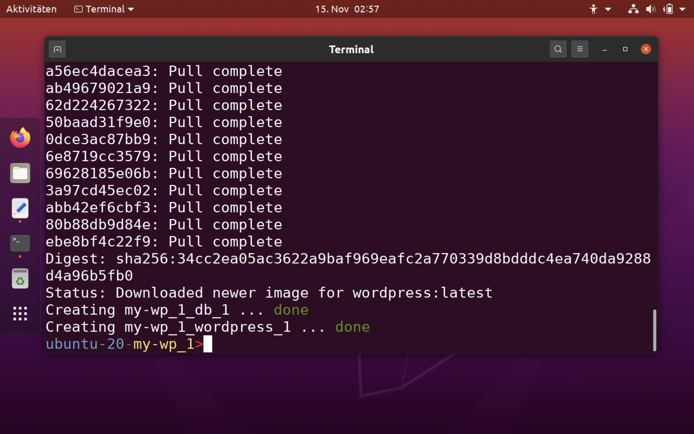
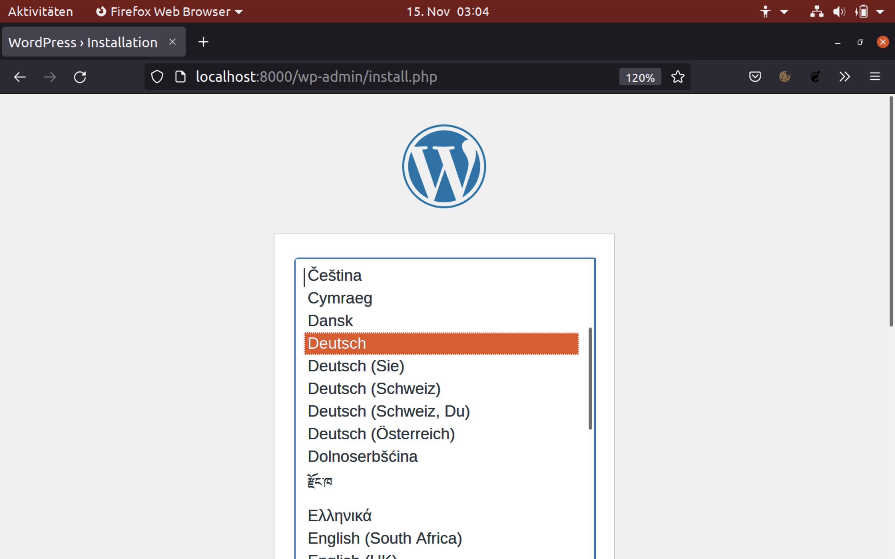

Um neue Funktionen, Templates oder Einstellungen für eine Website auszuprobieren eignet sich die Installation von Wordpress in einem Docker- Container auf dem eigenen Computer besonders gut. Hat man einmal das Grundgerüst für den Container eingerichtet, kann man daraus in wenigen Schritten neue Container erstellen. Das erspart dann die sonst erforderliche Einrichtung von Server, Datenbank und Wordpress nebst deren Verknüpfung.

Erstellt wird eine Docker- compose- Datei für Wordpress mit der Datenbank MySQL, der Netzwerkverbindung und jeweils Volums für die Daten. Erforderlich sind die nachfolgenden Schritte:

1. docker- engine installieren
2. docker-compose installieren
3. ein Verzeichnis für den neuen Wordpress- Container einrichten
4. die docker-compose.yaml Datei erstellen
5. Starten

Punkt 1. und 2. werden in einem separaten Beitrag erklärt.

## Die Docker- compose Datei:

Für das Projekt wurde ein Projektverzeichnis `my-wp_1`eingerichtet,  und in diesem dann die yaml-Datei gespeichert.

```yaml
version: "3.9"
    
services:
  db:
    image: mysql:5.7
    volumes:
      - db_data:/var/lib/mysql
    restart: always
    environment:
      MYSQL_ROOT_PASSWORD: somewordpress
      MYSQL_DATABASE: wordpress
      MYSQL_USER: wordpress
      MYSQL_PASSWORD: wordpress
    
  wordpress:
    depends_on:
      - db
    image: wordpress:latest
    volumes:
      - wordpress_data:/var/www/html
    ports:
      - "8000:80"
    restart: always
    environment:
      WORDPRESS_DB_HOST: db:3306
      WORDPRESS_DB_USER: wordpress
      WORDPRESS_DB_PASSWORD: wordpress
      WORDPRESS_DB_NAME: wordpress
volumes:
  db_data: {}
  wordpress_data: {}
```


Ist die Datei erstellt startet man im Terminal mit dem Befehl 

`sudo docker-compose up -d`  von zuvor erstellten Projektverzeichnis aus.

Dies führt `docker-compose up` im detached mode aus, holt die benötigten Docker-Images und startet die Wordpress- und Datenbank-Container, wie im folgenden Beispiel gezeigt.

Dabei bedeutet **detached mode**, der Docker Container wird im Hintergrund ausgeführt. Es werden dabei keine Ausgaben angezeigt und das Terminal steht für andere Befehle zur Verfügung.



Der Vorgang kann eine Weile dauern, je nach Rechner und Internetgeschwindigkeit.

## Aufrufen von WordPress in einem Webbrowser

Jetzt sollte WordPress auf Port 8000 des Docker-Hosts laufen, und man kann die "berühmte Fünf-Minuten-Installation" als WordPress-Administrator abschließen.

**Hinweis**: Die WordPress-Seite ist nicht sofort auf Port 8000 verfügbar, da die Container noch initialisiert werden und es einige Minuten dauern kann, bis sie das erste Mal geladen werden.

Aufruf in der Adresszeile des Browsers:

`http://localhost:8000`





## Herunterfahren und Aufräumen

Mit dem Befehl `docker-compose down`  werden die Container und das Standardnetzwerk entfernt, die WordPress-Datenbank bleibt jedoch erhalten.

Mit dem Befehl `docker-compose down --volumes`  werden die Container, das Standardnetzwerk und die WordPress-Datenbank entfernt.


___

Quellen:

[docker.docs](https://docs.docker.com/samples/wordpress/)