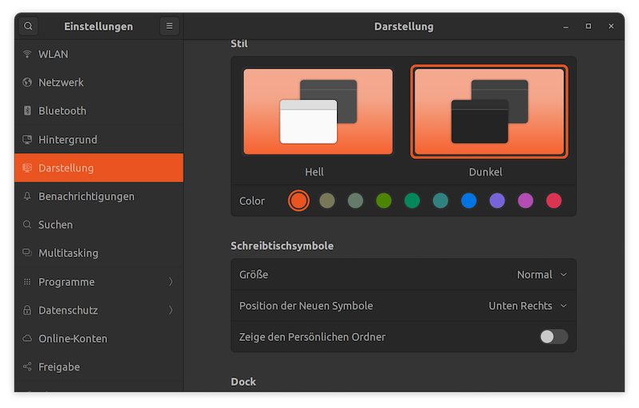
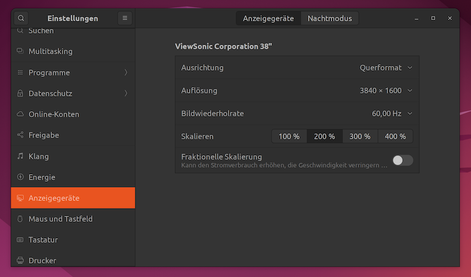
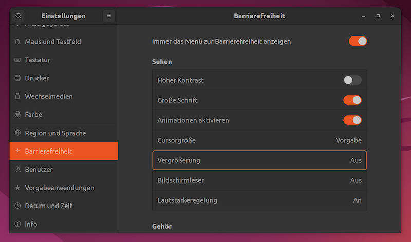
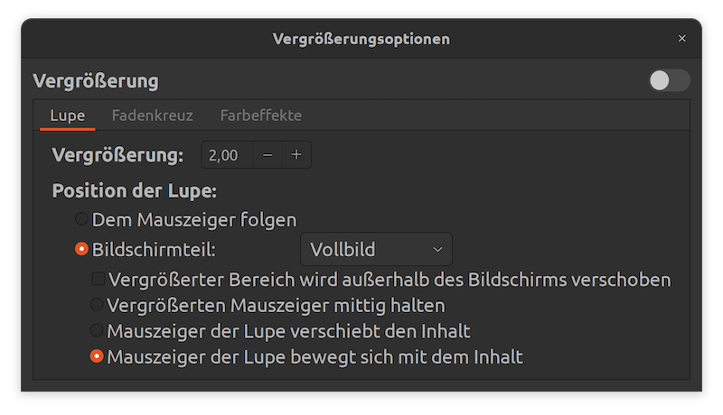
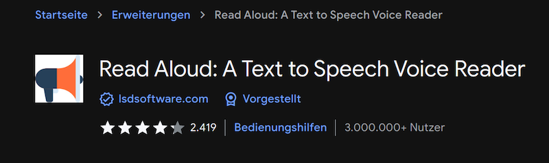
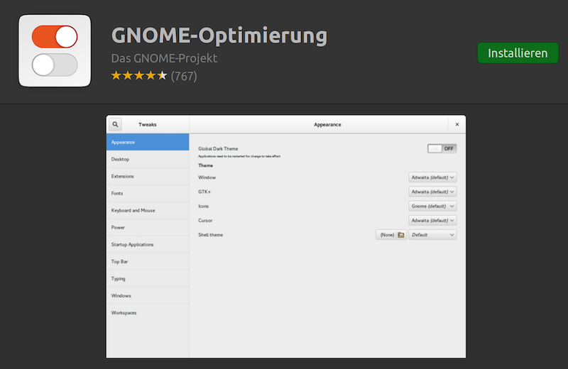
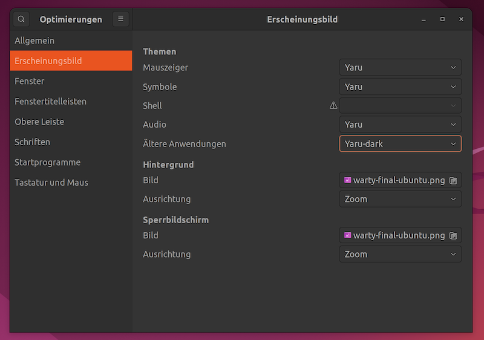

Die im April erschienene neue Ubuntu-Version  enthält viele der mit Gnome 42 eingeführten Neuerungen. Damit liefert es eine gut anpassbare und aufgeräumte Benutzeroberfläche, die insbesondere Menschen mit Augenproblemen sehr entgegenkommt. Anders als derzeit bei Fedora 36, das Gnome 42 schon vollständig integriert hat, funktioniert der Screenreader Orca auf Anhieb und liest alle gängigen Anwendungen und Texte. Besonders erfreulich ist, dass Orca nun auch mit Visual Studio Code und dem Browser Google Chrome zurecht kommt, was lange Zeit nicht der Fall war.

## Dunkler Modus und Akzentfarbe

Ein dunkler Modus steht nun ohne die Installation ergänzender Software systemweit zur Verfügung. Zusätzlich kann man aus mehreren Akzentfarben wählen und damit die Farbe von Schaltflächen und Systemtext anpassen.

    

Hier lassen sich auch die Größe der Symbole und das Verhalten des Docks verändern.

## Bildschirmdarstellung anpassen

Über den Menüpunkt **Anzeigegeräte** der Einstellungsverwaltung kann man unterschiedliche Skalierungen für die Darstellung wählen. Die angebotenen Optionen sind je nach vorgewählter Auflösung unterschiedlich.

Die vorgegebenen Prozentwerte von hier 100% bis 400% funktionieren gut. Aktiviert man hingegen die **Fraktionelle Skalierung**, kann es vorkommen, dass der Bildschirm unmittelbar in den höchsten Skalierungsfaktor wechselt und sich auch nur durch einen Neustart des Systems wieder davon abbringen lässt.

## Einstelllungen für Barrierefreiheit

Wie bereits in den Vorgängerversionen hat Ubuntu mit Gnome viele Funktionen für die Barrierefreiheit mit an Bord.

### Bildschirmlupe

Besonders erwähnenswert ist, dass nun auch - endlich - die Bildschirmlupe für den produktiven Einsatz taugt. Das Bild springt nicht mehr ständig hin und her und sie liefert eine prächtige Vergrößerung, die z.B. sehr hilfreich ist zum Korrigiern von Texten oder Bearbeiten von Bereichen, wo der Bildschirmleser nicht ausrecht.

Sehr nützlich ist sie auch zum Ansehen von Videotutorials mit Programmierbeispielen. Auf YouTube zeigen diese doch oftmals sehr kleinen Text, wo auch der Vollbildmodus nicht ausreicht, um noch etwas lesen zu können. Schaltet man zuerst die Bildschirmlupe ein und dann den Vollbildmodus, lässt sich das Video zusätzlich ordentlich vergrößern. Den Fokus verschiebt man einfach mit Bewegen der Maus, so dass dennoch alle Bedienelemente erreichbar bleiben.

## Screenreader

Der Bildschirmleser Orca liest inzwischen auch den Text in Programmen vor, die früher nicht zugänglich waren, Zu nennen sind die bereits in vorangegangenen Artikeln vorgestellten Anwendungen: die IDE Visual Studio Code und der Markdown-Editor Typora.

Auch Google-Chrome war lange Zeit unter Linux nicht zugänglich, funktioniert jetzt aber mit Orca wirklich gut. Zusätzlich bietet Chrome das Add-On **Read-Aloud**, das den Text von Webseiten vorlesen kann und hierzu Google-Stimmen einsetzt.

Leider lassen sich nur die Standardstimmen auswählen, ich persönlich ziehe Orca der deutschen Google-Standardstimme vor. Aber die englischen Stimmen sind gut anzuhören und für englische Texte eine gute Wahl.

Firefox bietet Ubuntu 22.04 nur noch als Snap-Paket an, Dies hat zur Folge, dass der Zugriff auf einige Schnittstellen eingeschränkt ist. Vorlesefunktionen, die auf der Web-Speech-Api beruhen, sind nicht mehr nutzbar. Dementsprechend wird die Vorlesefunktion im Lesemodus nicht mehr angeboten.

## Zusätzliche Anpassungen

Das Programm **GNOME Optimierungen** steht nach wie vor über die Softwareverwaltung zur Verfügung.

Mit dieser Zusatzsoftware lassen sich weitere Anpassungen vornehmen. So kann man z.B. die Schriftgröße insgesamt oder für einzelne Bereiche nochmals erhöhen.

Ein neuer Menüpunkt ermöglicht die Vorgabe eines dunklen Themas auch für ältere Anwendungen:

## Fazit

Ubuntu 22.04 liefert eine durchdachte Benutzeroberfläche mit augenfreundlichem dunklen Modus und erfrischender Farbgestaltung. Verbesserte Funktionen der Barrierefreiheit und sehr gute Anpassbarkeit machen die Distribution zu einer Empfehlung für Menschen mit Augenproblemen.